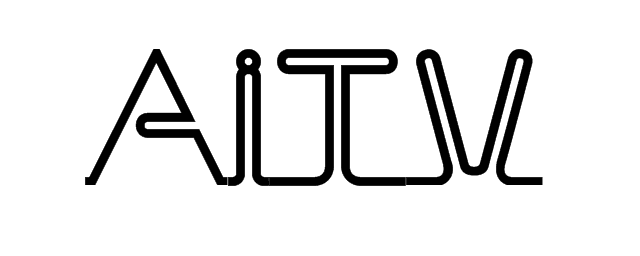

## 标志设计说明

"AI" 是英文“Artificial Intelligence" 的缩写，表示“人工智能”，连读发音“爱”，T是英文“Transform"的首字母，表示”转换“，V是英文”Video"的首字母，代表“影像”，三者一笔连起来，表示连续动作，中文浓缩为“爱转影”，表示用人工智能对影像进行持续转换。

公司的业务是研究如何用人工智能对影像“小转大， 模糊转清晰，黑白转彩色，静转动”，期望将美好的影像带给世界，“AI”传递了“人工智能”的内涵，也传递了“爱人爱己，共建美好”的理念，所以“爱转影”体现了公司的业务特点和经营思想。
